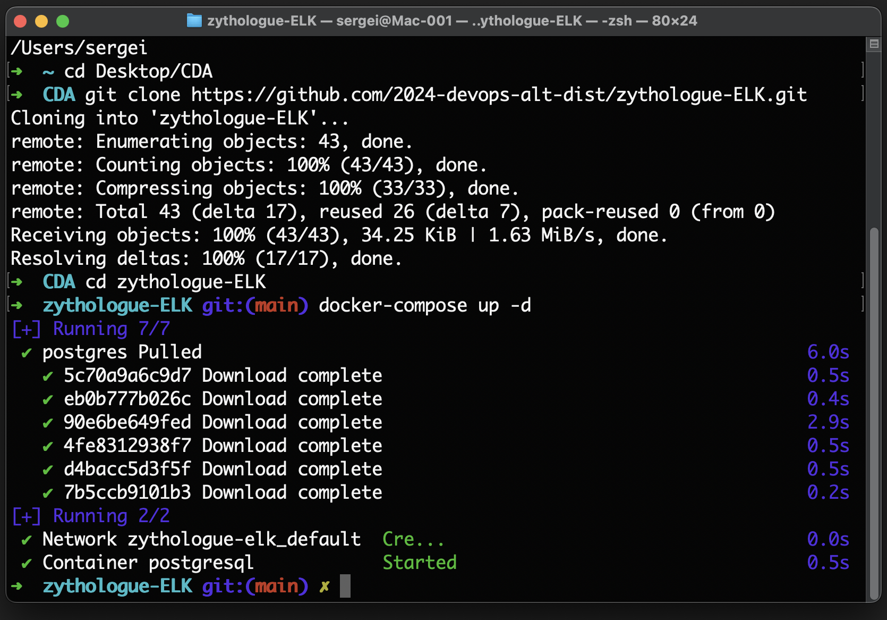
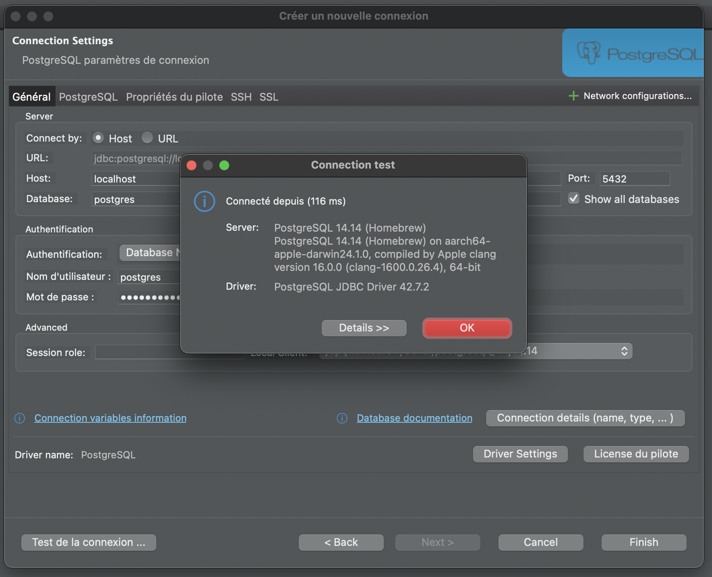
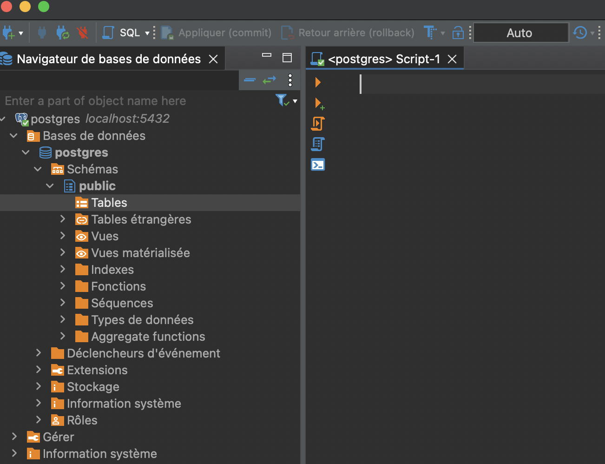

## Screenshots

Here are the screenshots for the project:

1. J'ai cloné le dépôt Zythologue d'Emmanuel depuis GitHub sur mon ordinateur. 

Pour ce faire, j'ai utilisé la commande suivante dans mon terminal :

```
git clone git@github.com:2024-devops-alt-dist/zythologue-ELK.git
cd zythologue-ELK
```

La première ligne a copié le projet, et la seconde m'a permis d'accéder au dossier du projet fraîchement cloné.

2. Ensuite, j'ai lancé Docker pour créer un environnement isolé pour la base de données. J'ai exécuté la commande suivante dans le terminal, toujours depuis le dossier zythologue-ELK :

```
docker-compose up -d
```

L'option -d a permis de lancer Docker en arrière-plan.


3. Ensuite, j'ai connecté DBeaver à PostgreSQL. DBeaver est un outil qui me permet d'interagir visuellement avec les bases de données.

J'ai d'abord ouvert le projet dans DBeaver : j'ai cliqué sur "Open project from file system", j'ai choisi "Directory", puis j'ai sélectionné le dossier zythologue-ELK que j'avais cloné.

Pour créer une nouvelle connexion, j'ai cliqué sur "Database" > "New Database Connection" et j'ai choisi "PostgreSQL".

J'ai configuré la connexion en remplissant les champs suivants :

- **Host :** localhost
- **Port :** 5432
- **Database :** Postgres
- **Username :** postgresql (**Note:** J'ai probablement dû utiliser postgres comme nom d'utilisateur, car postgresql est rarement l'utilisateur par défaut)
- **Password :** postgresql (**Note:** Le mot de passe par défaut est généralement aussi postgres)

J'ai ensuite testé la connexion en cliquant sur "Test Connection". Une fois la connexion réussie, j'ai cliqué sur "Finish" pour l'enregistrer. DBeaver m'a peut-être demandé d'installer des drivers supplémentaires, ce que j'ai accepté.



4. Pour finir, j'ai exécuté les scripts SQL afin de créer les tables et d'insérer les données.

J'ai ouvert les scripts dans DBeaver. J'ai pu le faire en appuyant sur F3 ou en faisant un clic droit sur la base de données ("Postgres") > "SQL Editor" > "Open SQL Script", puis en naviguant jusqu'aux fichiers .sql dans mon dossier zythologue-ELK. Les trois scripts importants étaient :

- ddl_creation_script.sql (pour créer les tables)
- ddl_insertion_script.sql (pour insérer les données)
- dml_analytic_script.sql (contenant les requêtes d'analyse)

J'ai exécuté chaque script dans l'éditeur SQL de DBeaver en cliquant sur le bouton "Exécuter" (ou en utilisant Ctrl+Entrée). Il était important d'exécuter les scripts dans l'ordre mentionné ci-dessus.


En résumé, j'ai **cloné le projet**, **lancé Docker**, connecté **DBeaver** à la base de données Docker, puis **exécuté les scripts SQL** pour créer la structure et les données de la base de données. Après cela, j'ai pu **explorer les données** et vérifier que tout fonctionnait comme prévu. Le fichier zythologue_data_conceptualization.drawio mentionné dans le README m'a probablement fourni des diagrammes utiles pour comprendre la structure de la base de données.

